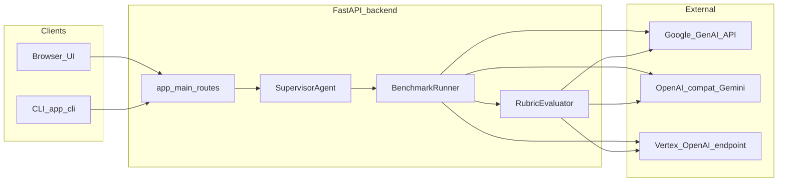
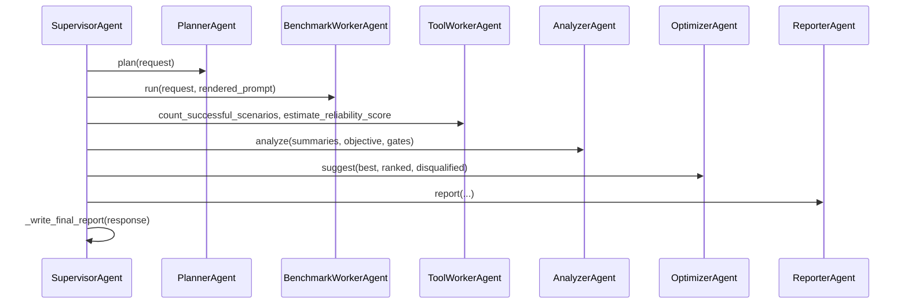
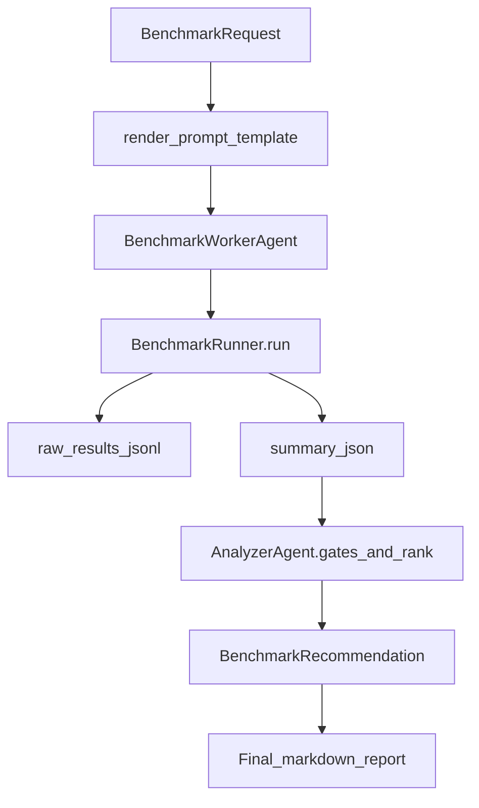

# Gemini Benchmark Studio — Architecture

This document describes the **end-to-end architecture** of Gemini Benchmark Studio: a web application for benchmarking Gemini latency modes (TTFT, E2E), optional **rubric-based accuracy evaluation**, **tiered acceptance gates**, and **multi-agent** recommendations. It is intended for engineers extending the product or running it in production.

---

## 1. Goals and scope

| Capability | Responsibility |
|------------|----------------|
| **Latency** | Measure TTFT and end-to-end latency across stacks, models, streaming, thinking, and cache strategies. |
| **Accuracy (optional)** | Score outputs with an LLM judge using a weighted rubric; aggregate per scenario. |
| **Acceptance** | Enforce tiered thresholds (accuracy, optional TTFT ceiling) before ranking scenarios. |
| **Decision support** | Rank scenarios, explain disqualifications, suggest alternatives, emit human-readable reports. |
| **Reproducibility** | Persist run artifacts (JSONL, CSV, summaries, reports) and optional run history metadata (no API keys). |

---

## 2. System context (high level)

- **Frontend** talks only to the **FastAPI** HTTP API (same origin or CORS).
- **CLI** (`python -m app.cli`) builds the same `BenchmarkRequest` payloads and invokes the same engine path where applicable.
- **Inference** uses the Google GenAI SDK, OpenAI-compatible Gemini endpoints, or Vertex AI OpenAI-style endpoints, depending on `stacks` and configuration.

---

## 3. Repository layout

| Path | Role |
|------|------|
| `frontend/` | React + Vite SPA; single-page UI for configuration, runs, history, token count, optimization. |
| `backend/app/` | FastAPI app, Pydantic schemas, defaults, CLI entrypoint. |
| `backend/app/services/` | Core services: benchmark execution, token counting, prompt rendering, evaluation, history, uploads. |
| `backend/agent/` | Multi-agent orchestration (supervisor, planner, worker, analyzer, optimizer, reporter, prompt optimizer). |
| `backend/outputs/` | Default root for benchmark run artifacts (JSONL, CSV, JSON, markdown reports). |
| `docker-compose.yml` | Orchestrates frontend + backend with volume for `outputs/`. |

---

## 4. Frontend architecture

- **Stack**: React 18+, TypeScript, Vite build; static assets served by nginx in Docker.
- **State**: Local React state (`useState` / `useMemo` / `useEffect`); no global store required.
- **API**: `frontend/src/api.ts` wraps `fetch` to backend routes; `frontend/src/types.ts` mirrors backend Pydantic models.
- **Key UX areas**:
  - Run settings (stack, model, trials, schedule, Vertex fields).
  - Mode selection (streaming, thinking, cache intent, model-aware thinking).
  - Prompt template + variables; preview; exact token count (mode-aware).
  - Prompt optimization (variants + optional optimize-and-benchmark).
  - Results: scenario table, ranked recommendations, acceptance report table, artifacts, history compare.

**Configuration**: `VITE_API_BASE_URL` (Docker build arg) points the browser to the backend (e.g. `http://localhost:8000`).

---

## 5. Backend API (FastAPI)

**Entry**: `backend/app/main.py`

| Area | Endpoints (representative) |
|------|----------------------------|
| Health | `GET /api/health` |
| Defaults | `GET /api/benchmark/default-modes` |
| Prompt | `POST /api/prompt/preview`, `POST /api/prompt/token-count`, `POST /api/prompt/optimize`, `POST /api/prompt/upload-context` |
| Benchmark | `POST /api/benchmark/run` — runs full supervisor pipeline; **500** on workflow failure with structured `detail` (includes fallback payload). |
| Combined | `POST /api/prompt/optimize-and-benchmark` — optimization then benchmark; may set `benchmark_failed` if benchmark phase fails. |
| History | `GET /api/benchmark/history` |

**Validation**: `_validate_benchmark_request` enforces API keys / Vertex config, thinking compatibility, and schedule window rules.

---

## 6. Multi-agent system (supervisor pattern)

**Orchestrator**: `backend/agent/supervisor_agent.py` — `SupervisorAgent.run()`

| Agent | File | Responsibility |
|-------|------|----------------|
| **Planner** | `planner_agent.py` | Validates / plans scenario generation (uses runner for scenario preview). |
| **Benchmark worker** | `benchmark_worker_agent.py` | Calls `BenchmarkRunner.run()` with rendered prompt. |
| **Tool worker** | `tool_worker_agent.py` | Lightweight ADK-style tool execution (counts, reliability proxy). |
| **Analyzer** | `analyzer_agent.py` | Eligibility gates, objective-weighted ranking, **tiered acceptance** (accuracy + optional TTFT ceiling), disqualified reasons. |
| **Optimizer** | `optimizer_agent.py` | Suggests alternatives from ranked / disqualified context. |
| **Reporter** | `reporter_agent.py` | Natural-language rationale for the recommendation. |
| **Prompt optimizer** | `prompt_optimizer_agent.py` | Prompt variant generation (used by optimize endpoints). |

**ADK runtime**: `adk_runtime.py` provides a minimal bridge for registered tools (not full cloud ADK deployment).

---

## 7. Benchmark engine

**Core**: `backend/app/services/benchmark_runner.py` — `BenchmarkRunner`

### 7.1 Scenarios

- Cartesian product over: stacks (`stacks`), models (`models`), streaming mode, thinking on/off, **selected cache strategies only** (none / implicit_reuse / explicit_cache), prompt types (`short_prompt` / `long_context` if `include_long_context`).
- Each scenario has a stable `scenario_id` string encoding stack, model, mode, thinking, cache, prompt type, etc.

### 7.2 Adapters

| Adapter | When used | Notes |
|---------|-----------|--------|
| `GoogleGenAIAdapter` | `google_genai` | Full thinking + explicit cache (cache API) + TTFT semantics for thinking streams. |
| `OpenAICompatAdapter` | `openai_compat` | No explicit cache / thinking toggle in this path. |
| `VertexAPIAdapter` | `vertex_api` | OpenAI client against Vertex endpoint; ADC or token. |

### 7.3 Thinking

- `backend/app/services/thinking_config.py` resolves **budget vs level** thinking per model family (`thinking_mode`, `thinking_level`, `thinking_token_budget`).

### 7.4 Scheduling

- Optional **global** schedule: all planned iterations (warmups + trials) across **all** scenarios are interleaved in one execution plan; slots spread across the configured window (e.g. 15 minutes).

### 7.5 Outputs and artifacts

Per run directory under `outputs/gemini_ttft/<run_id>/`:

| Artifact | Purpose |
|----------|---------|
| `raw_results.jsonl` | Per-iteration rows: latency, status, optional evaluation fields, scheduled timestamps. |
| `summary.json` / `summary.csv` | Aggregated per-scenario metrics. |
| `report.md` | Initial runner-generated latency report (overwritten by supervisor with full Studio report). |
| `evaluation_summary.json` | Per-scenario accuracy aggregates when evaluation produces scores. |

**Supervisor** overwrites `report.md` with a consolidated markdown report: recommendation, ranked tables, acceptance summary, disqualified list, alternatives, artifacts list, and **Report completeness (self-check)**.

---

## 8. Evaluation and acceptance

**Service**: `backend/app/services/evaluator.py` — `RubricEvaluator`

- Builds a deterministic judge prompt from `EvaluationConfig` (criteria, weights, tier).
- Parses JSON (or embedded JSON) from judge output; clamps scores to `[0,1]`; on failure returns `evaluation_error` without crashing the run.

**When `evaluation_enabled`**: non-warmup successful trials are evaluated; raw rows and summaries carry accuracy aggregates.

**Analyzer gates** (per `acceptance_tier` and `evaluation.tier_thresholds`):

- Minimum accuracy (aggregate `accuracy_score` when evaluation is on).
- Optional maximum TTFT P50.
- Disqualification reasons: `failed_accuracy_gate`, `failed_latency_gate_for_tier`, `evaluation_unavailable`, plus existing reliability reasons.

**Response fields**: `ScenarioSummary` and `BenchmarkRecommendation` include acceptance and gate counts; UI can show an **Acceptance Report** table with deltas.

---

## 9. Supporting services

| Module | Purpose |
|--------|---------|
| `prompt_template.py` | `{{variable}}` rendering. |
| `token_counter.py` | Exact provider token counts; mode-aware breakdown for cache economics. |
| `history_store.py` | Persist run metadata (request snapshot without `api_key`; artifacts paths). |
| `data_upload.py` | Extract text from uploaded files into prompt variables. |
| `defaults.py` | Default modes and presets for API/UI. |

---

## 10. CLI

**Entry**: `backend/app/cli.py`

- Constructs `BenchmarkRequest` from flags and JSON variables; aligns with server defaults (non-streaming, thinking, etc. per product design).
- Root wrapper: `run_benchmark_cli.sh` for convenience.

---

## 11. Deployment

- **Docker Compose**: backend exposes port `8000`, frontend `80` (mapped to host); `./backend/outputs` mounted for persistence.
- **Production considerations**: restrict CORS, TLS termination, secrets via env/secrets manager, rate limits, and monitor `outputs/` disk usage.

---

## 12. Security and privacy

- API keys are **not** persisted in history or written into artifacts as a first-class field; request snapshots exclude `api_key`.
- Vertex optional `access_token` should be treated as sensitive; avoid logging full request bodies in production.

---

## 13. Extension points

| Change | Where to look |
|--------|----------------|
| New stack | Adapter in `benchmark_runner.py`, validation in `main.py`, UI stack options in `App.tsx`. |
| New metric | Raw row + `_aggregate()` + `ScenarioSummary` + analyzer weights. |
| New recommendation objective | `analyzer_agent.py` weights + schema + UI. |
| Stronger evaluation | `evaluator.py` prompt/schema; optional second judge or human-in-the-loop export. |

---

## 14. Diagram: request to benchmark response

This file is the **canonical architecture overview** for Gemini Benchmark Studio. For feature-level usage, see [README.md](./README.md).
